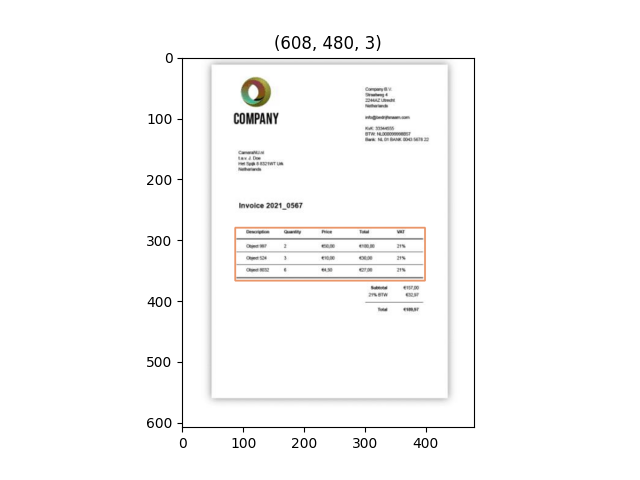

# Create env

    conda env create -f environment.yml
    conda activate table_pdf
    pip install -r requirements.txt
    pip install layoutparser torchvision && pip install "git+https://github.com/facebookresearch/detectron2.git@v0.5#egg=detectron2"
    pip install pytesseract

## Usage
### PDF format

    To find tables in a pdf file and images in a pdf file, we use `script_for_pdf.py`
    in `script_for_pdf.py` use module table to find tables in a pdf file and the fits module for extracting images

### Image format
    To find tables in pictures, we use `script_for_images.py`
    in script_for_images.py use Detectron2LayoutModel model to detect table and pytesseract to convert table on image to csv table.

### Result
    Input folder to process and output folder with result 
    
